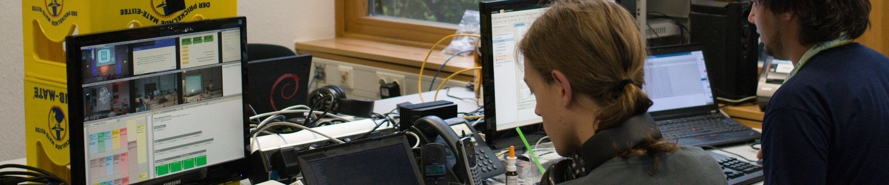



## Past Events


<!-- 2021 -->
	 <!-- 2021-04-02 -->

<!-- 2020 -->
	 <!-- 2020-12-27 -->
	 <!-- 2020-09-04 -->
	 <!-- 2020-08-21 -->
	 <!-- 2020-04-11 -->

<!-- 2019 -->
	 <!-- 2019-12-27 -->

<!-- 2018 -->
	 <!-- 2018-08-25 -->
	 <!-- 2018-06-27 -->
	 <!-- 2018-05-23 -->
	 <!-- 2018-03-21 -->
	 <!-- 2018-01-26 -->

<!-- 2017 -->
	
	 <!-- 2017-10-28 -->
	 <!-- 2017-08-19 -->
	 <!-- 2017-07-06 -->
	 <!-- 2017-04-28 -->
	 <!-- 2017-04-14 -->

<!-- 2016 -->
	
	 <!-- 2016-10-?? -->
	
	 <!-- 2016-08-24 -->
	 <!-- 2016-08-20 -->
	 <!-- 2016-08-05 -->
	 <!-- 2016-06-10 -->
	 <!-- 2016-05-26 -->

<!-- 2015 -->
	 <!-- 2015-08-23 -->
	 <!-- 2015-08-13 -->
	 <!-- 2015-06-04 -->
	 <!-- 2015-05-15 -->
	 <!-- 2015-04-03 -->
	 <!-- 2015-03-11 -->

<!-- 2014 -->
	
	
	
	
	
	
	
	

<!-- 2013 -->
	
	
	 

<!-- 2011 -->
	 

